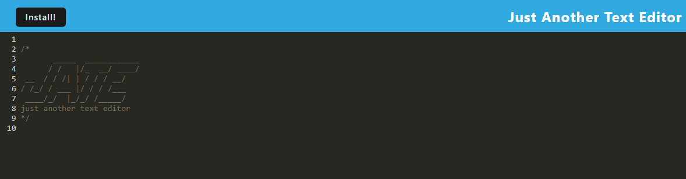

# JATE - Just Another Text Editor

[](https://opensource.org/licenses/MIT)

JATE is a simple but reliable text editor for note-taking or code-snippets, online or offline. The application adhere the Progressive Web App (PWA) ensuring a responsive interface. The application can be found as a full-stack application on the heroku platform. It utilizes an idb API, which is trusted by big companies such as Google and Mozilla.

## Features
- Offline Text Editor
- Data Saving
- Note Taking

## Live Preview

Website: 
https://pwa-text-editor-24-ad8b9f5fa3ad.herokuapp.com/

## Table of Contents
- [Installation](#installation)
- [Usage](#usage)
- [Contributing](#contributing)
- [License](#license)
- [Questions](#questions)

### Installation

Before using this application, you'll need to install the necessary dependencies. To do this follow the instructions below:
```bash
npm install
```

## Usage
```bash
npm start
```
This should run build and run server.


## License

This project is licensed under the MIT License- see the [https://opensource.org/licenses/MIT](https://opensource.org/licenses/MIT) file for details.

## Contributing
If you would like to contribute to this project, please follow the guidelines outlined in the Contributing Guide.

## Questions
If you have questions or need further assistance with this project, please feel free to contact me via:
- E-Mail: CarrilloUriel81@gmail.com
- GitHub: [UCarr81](https://github.com/UCarr81)